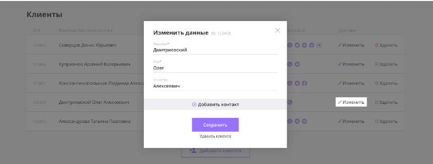
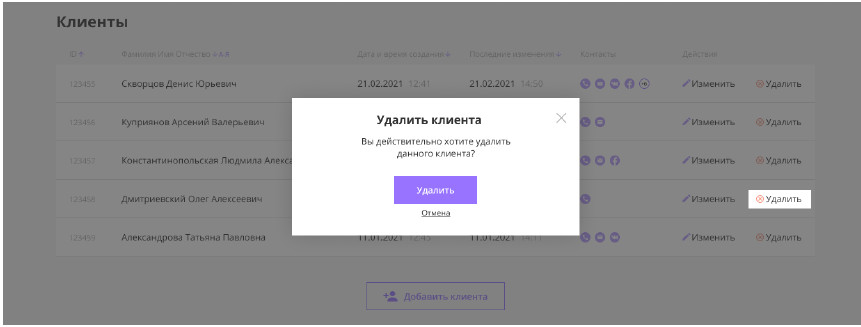
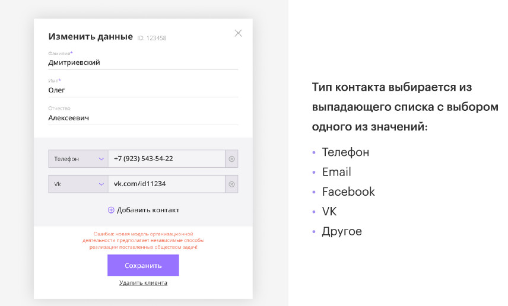
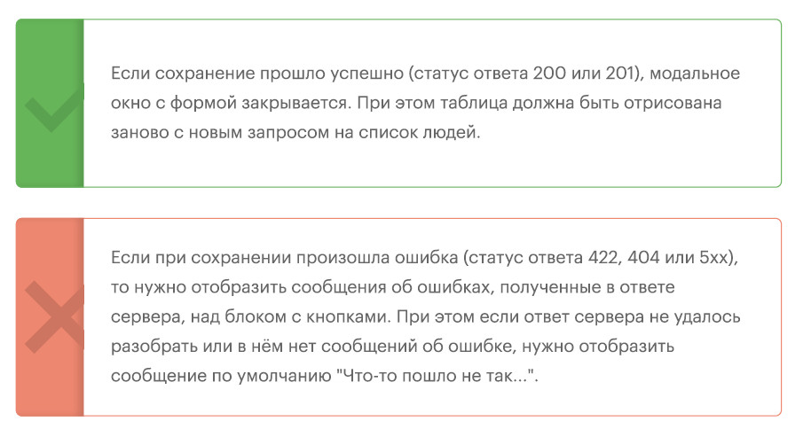

# Система управления контактными данными клиентов.
  
## Краткое описание работы
Задача разработать frontend часть сервернго приложения - crm системы клиентов согласно макета и требований Заказчика.
Набор требований к системе на момент её запуска. В ней должны быть следующие функции:

1. Просмотр списка клиентов в виде таблицы
2. Добавление нового клиента
3. Изменение информации о существующем клиенте (ФИО и контактная информация)

### Техническое задание
Разработать web-интерфейс для CRM системы, в которой должны быть следующие
возможности:

* Просмотр списка людей в виде таблицы

* Добавление нового клиента

* Изменение информации о существующем клиенте

Каждый контакт представляет из себя следующий набор данных:

1. Имя

2. Фамилия

3. Отчество

Массив объектов с контактными данными, где каждый объект содержит:

* Тип контакта (телефон, email, VK и т.п.)

* Значение контакта (номер телефона, адрес email, ссылка на страницу в VK и т.п.)

Интерфейс представляет из себя единственную страницу, на которой располагается
таблица клиентов, кнопка для добавления нового клиента, а также шапка с логотипом
компании и строкой поиска клиентов.

***Таблица со списком людей имеет следующие колонки:***

1. ID

2. ФИО (Фамилия Имя Отчество через пробел)

3. Дата и время создания

4. Дата и время последнего изменения

5. Контакты

6. Действия (кнопки):

      * Изменить клиента
      * Удалить клиента

***Таблица должна строиться на основе данных из API. При первичной загрузке нужно отображать индикатор загрузки, пока таблица с данными не будет построена.***

### Сортировка

Все заголовки колонок, кроме контактов и действий, можно нажать, чтобы
установить сортировку по соответствующему полю. Первое нажатие
устанавливает сортировку по возрастанию, повторное - по убыванию.
Сортировка должна происходить из JavaScript, то есть API передаёт данные
в неотсортированном виде. По умолчанию должна быть установлена сортировка по возрастанию по ID.

Состояние сортировки должно корректно отображаться в виде соответствующих
иконок около заголовков.

### Поиск

При вводе текста в поле для поиска данные для таблицы должны быть
перезапрошены из API с введённым поисковым запросом. При этом запрос
должен отправляться только по прошествии 300мс с момента последнего ввода
символа в поле (то есть нужно ожидать, пока пользователь не завершит ввод
поискового запроса).

### Отображение контактов клиента

В колонке с контактами для контактов VK, Facebook, телефона и email должны
отображаться соответствующие иконки. Все остальные виды контактов отображаются
с одинаковыми иконками с человечком.

При наведении указателя на контакт должна показываться
всплывающая подсказка с типом и значением этого контакта в
формате "**Тип**: значение" (Например: "**Email**: abc@abc.ru",
"**Телефон**: +71234567890", "**Twitter**: @xyz").
Отображение контактов клиента

### Действия над клиентами

При нажатии на кнопку "Изменить" должно появиться модальное окно с формой
изменения клиента. Подробное описание поведения формы приведено ниже 

При нажатии на кнопку "Удалить" должно появиться модальное окно с подтверждением
действия. Если пользователь подтверждает удаление, то человек должен быть удалён
из списка. Также на сервер с API должен посылаться запрос на удаление. 

### Формы создания или редактирования данных о клиентах

Форма создания клиента должна открываться в виде модального окна по нажатию на
кнопку "Добавить клиента", находящуюся под таблицей. Форма редактирования
клиента должна открываться по нажатию на кнопку "Изменить" в таблице клиентов.

Форма создания клиента открывается сразу с незаполненными полями.

При изменении клиента перед открытием формы из API должны быть запрошены
свежие данные клиента, только после получения этих данных должна открыться
форма. При этом форма должна быть заполнена соответствующими данными клиента.

### Контакты клиента

В блоке контактов нужно предусмотреть возможность добавления до 10 контактов
включительно. Для этого под добавленными контактами должна быть кнопка
"Добавить контакт". Если у клиента уже добавлено 10 контактов, кнопка не должна
отображаться. 
Каждый контакт можно удалить из списка по нажатию на крестик справа от него.

### Кнопки

Под формой должна располагаться кнопка "Сохранить". Кнопка "Удалить клиента"
добавляется, если это форма редактирования существующего в базе данных
человека.

По нажатию на кнопку удаления клиент должен быть удалён из таблицы, а на сервер
API должен быть отправлен запрос на удаление клиента. Модальное окно с формой
должно закрыться

По нажатию на кнопку сохранения изменения должны быть отправлены на сервер с
использованием метода создания или изменения существующего клиента. Далее в
зависимости от ответа сервера: 
